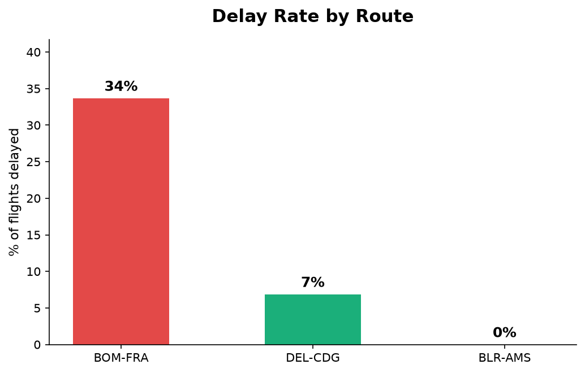
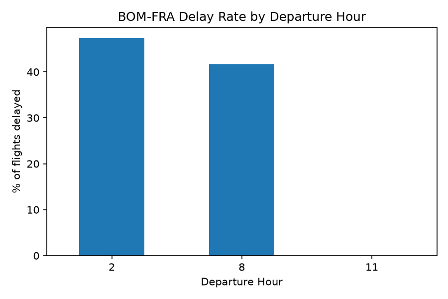

# RouteWatch

Self-collected flight tracking and delay analysis for India-Europe air travel.

## Why this project

Most portfolio flight-delay projects use the same well-worn Kaggle dataset (US domestic flights, 2015). Free, ready-made international flight delay data doesn't really exist, so instead of downloading something, I built the dataset myself. A script pulls live flight status data daily from a real API, appending to a growing record over several weeks.

Europe has always been high on my personal travel bucket list, so the three routes tracked reflect genuine curiosity about air travel between India and different parts of Europe, not an assigned or arbitrary topic.

## What it does

- Tracks 3 India-Europe routes daily: Mumbai-Frankfurt, Delhi-Paris, Bengaluru-Amsterdam
- Builds a real dataset over time from live flight data, not a static download
- Investigates and documents real data quality issues found along the way
- Analyzes delay patterns by route, airline, day of week, and departure hour
- Trains and compares classification models to predict delay risk

## Data collection

`collect_data.py` calls the [Aviationstack](https://aviationstack.com) API once daily for each route and appends the results to `data/flights_log.csv`. Run it once a day and the dataset grows.

```bash
python collect_data.py
```

It needs an API key set as an environment variable (`AVIATIONSTACK_KEY`) in a local `.env` file that's never committed to the repo.

## Demo

Delay rate by route:



Mumbai-Frankfurt delay rate by departure hour:



## Data quality: four real issues found and resolved

Working with a live, imperfect API surfaced genuine data quality problems, not just clean textbook data. Each one was investigated, not assumed.

1. **The API's own delay field is unreliable.** I cross-checked `dep_delay_min` against the actual gap between scheduled and actual timestamps and they didn't match, with no consistent offset. Delay is now calculated directly from raw timestamps instead of trusted from the API.

2. **The `flight_status` label lags behind reality.** Some flights marked `scheduled` already had a real departure timestamp. A flight only counts as complete if it has a real arrival timestamp (`has_arrived`), no matter what the status field claims.

3. **Route plus date plus airline is not a unique flight identifier.** An airline can fly the same route more than once a day. I caught this by testing an assumption against real data instead of trusting it, and fixed it by capturing the actual flight number from the raw API response.

4. **Timestamps are local time, mislabeled as UTC.** I verified this by checking a flight's scheduled duration against a known realistic flight time. It doesn't affect delay calculations, since same-airport subtraction cancels the mislabeling out, but it would affect any cross-airport calculation like true flight duration.

Full reasoning for every decision in this project, including these findings, why alternatives were rejected, and how each was resolved, is documented in [`KNOWLEDGE.md`](./KNOWLEDGE.md).

## Key findings

- **Mumbai-Frankfurt is meaningfully less reliable than the other two routes.** Bengaluru-Amsterdam and Delhi-Paris both showed close to 0% delay rate (15+ min threshold), while Mumbai-Frankfurt has consistently run 15 to 30%+ delayed.
- **Delays on Mumbai-Frankfurt are spread across multiple airlines**, not concentrated in one carrier. That suggests a route or airport-level factor rather than one operator's issue.
- **Departure hour matters more than expected.** The 2 AM departure slot on Mumbai-Frankfurt has close to a 50% delay rate, versus 0% for the 11 AM slot, backed by the largest single sample in the dataset.
- **A day-of-week finding changed as more data came in.** Saturday went from an early 0% delay reading to 50% once the sample grew. I kept and explained this change transparently rather than quietly correcting it, since it's a genuine and expected part of doing analysis on a small, growing dataset.

## Modeling

- **Target:** binary classification, delayed (15+ min late, the industry-standard threshold) versus on time
- **Baseline model:** Logistic Regression. A first attempt with default settings had strong accuracy but weak recall on delayed flights, missing most real delays. That's a direct illustration of why accuracy alone is misleading under class imbalance. Using `class_weight='balanced'` fixed this directly.
- **Second model:** Random Forest, trained on the identical data split for a fair comparison. Performance came out nearly identical to Logistic Regression. The added complexity didn't earn its place at this dataset size, so I kept Logistic Regression as the primary model for its simplicity and interpretability.
- **Feature importance** from the model's coefficients closely matched the EDA findings independently, a good sign the model learned genuine patterns rather than noise.

## Tech stack

Python, pandas, scikit-learn, requests, python-dotenv, matplotlib/seaborn, Jupyter (via VS Code)

## Project structure

```
RouteWatch/
├── data/
│   └── flights_log.csv       # growing dataset, appended to daily
├── collect_data.py           # daily data collection script
├── explore.ipynb             # clean, organized analysis notebook
├── requirements.txt
├── KNOWLEDGE.md               # full reasoning log, every decision explained
├── .env                       # API key, not committed
└── .gitignore
```

## Setup

```bash
git clone https://github.com/khushi1215/RouteWatch.git
cd RouteWatch
python -m venv venv
venv\Scripts\activate          # Windows
source venv/bin/activate       # Linux/macOS
pip install -r requirements.txt
```

Add a `.env` file:
```
AVIATIONSTACK_KEY=your_key_here
```

## Limitations

- **Portfolio-scale dataset, not production-scale.** This was a deliberate tradeoff prioritizing depth of understanding over dataset size. Three routes were chosen specifically to keep per-route sample sizes meaningful within a free API tier's request limits.
- **Single time-window snapshot.** Collected over several weeks, so seasonal patterns like weather or holiday travel can't yet be separated from route-specific reliability.
- **Flight-level identity (`flight_number`) is only available from the point it was added to the collection script onward.** Earlier rows are still usable for aggregate analysis but not for per-flight tracking.
- **Small model test set.** Results get re-evaluated as the dataset grows rather than treated as final. An earlier "perfect recall" result was correctly predicted to soften once more data came in, and it did.

## What I'd do with more time

- Expand to more routes with a paid API tier for higher-frequency, broader coverage
- Collect across a full seasonal cycle to separate weather and seasonal effects from route-specific patterns
- Add a simple interface (Streamlit) to check delay risk for a specific route and time before booking
- Deduplicate historical flights using flight number now that it's consistently captured

---

For the complete decision-by-decision reasoning behind this project, every "why this and not that," every data quality investigation, and the full daily progress log, see [`KNOWLEDGE.md`](./KNOWLEDGE.md).